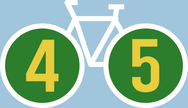
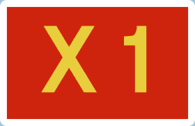

Like the national numbers city numbers are allocated in zones.
These zones are also the responsibility of the city.
An example of the zone practice can be seen in Boan City,
and is seen in the figure below.
One quirk of the system there is that "horizontal" means "along the coast"
and "vertical" means "perpendicular to the coast",
so it looks strange on a north-oriented map.

 

<figure class="full">

<figcaption markdown=1>
The horizontal (left) and vertical (right) zones of Boan City
are arranged so that they are bounded by roads
that are either major, classified roads
or by other Q-V roads that have a units digit of 0.
</figcaption>
</figure>

Within each zone there are usually attempts to have the numbers appear in order,
which means that as one goes further south in Boan the V numbers increase.
An interesting consequence is that a zone can run out of numbers
even if there are still many available otherwise,
resulting in the only road number in the world that is not an integer:
the Bohən Vescit, otherwise known as the V62½.

Different arrangements are made in different cities.
In Ð'TÞEK the roads are just numbered 
from the southwest corner without any zoning,
so the it has the Q1 and the V1
and the numbers increase from there.
Meanwhile in Concept City, the normal zone layout is used,
but roads that can't be reliably classed as horizontal or vertical
get D numbers instead,
which are given based on the numbers of the roads near them.
Numbers have up to three digits.

Finally, city numbers do not show up on road signs,
but they do show up on street signs,
where they appear below the street nameplate
in the case of the rectangular shields,
or on top of a pole in the case of the light bulb-shaped shields.

# Cycle routes: J #

Ùzje has a network of cycle routes.
The network is largely designed for short-distance travel,
with some long-distance routes available where cars can't reach.

Regardless of the density of the network,
it is indicated using a (somewhat cartoonish) bike-shaped shield
with exaggerated wheels that hold one digit each.
Due to there being more than 100 cycle paths in the territory,
numbers are only guaranteed to be unique within a particular highway zone.
However, there is a *second* class of numbers
that *are* unique throughout the entire territory.
They are distinguished by the number of letters in the designation:

* If the "front wheel" contains a letter, which must be A or B,
  then it is considered a long-range, inter-zonal cycle path.
  There are a maximum of 10 of each.
  
    The letter A is used to indicate that crossing the entire path
  requires going through water, whether by bridge or by ferry,
  whereas the letter B implies there are none.
  As such cycle routes
  B0 to B9
  only appear on the mainland,
  and some of these don't even manage to be inter-zonal at all
  due to number exhaustion there.
  
* If the "front wheel" is a digit, then it is a short-range,
  intra-zonal cycle path.
  There are a maximum of 100 of them in each zone,
  because 00 is also used,
  and is usually more significant than 01.
  
As can be seen by the shield on the road sign and the text-based shields above,
the "J" designation is completely theoretical;
it does not show up anywhere on the map.
However the law that describes the legal existence of these routes
does say that the letter "J" is associated with cycle routes,
as well as the colour pale green.

# Diversions: X #

When road works or other temporary changes in the road network comes along,
these yellow-on-red shields are used to guide users back to the original path
after they have passed the temporary change.

Diversion paths can be permanent or temporary.
When motorways are constructed,
some thought was given as to what to do when the motorway is closed,
and all-purpose roads are chosen to give an adequate alternative
to this contingency.
These are given numbers with two or three digits,
and are unique within the territory.

Else, the numbers 1 to 9 are used to respond to specific incidents,
and generally are not unique or even permanent;
each temporary arrangement uses these numbers in an *ad-hoc* manner
and they vanish as soon as the temporary arrangement ends.
